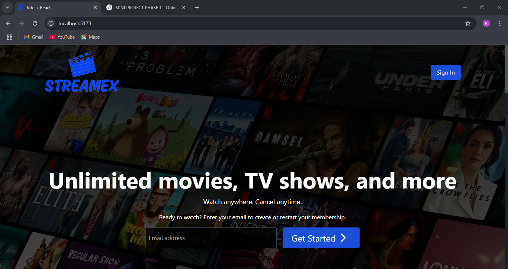
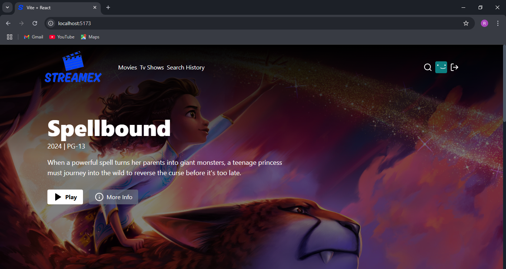
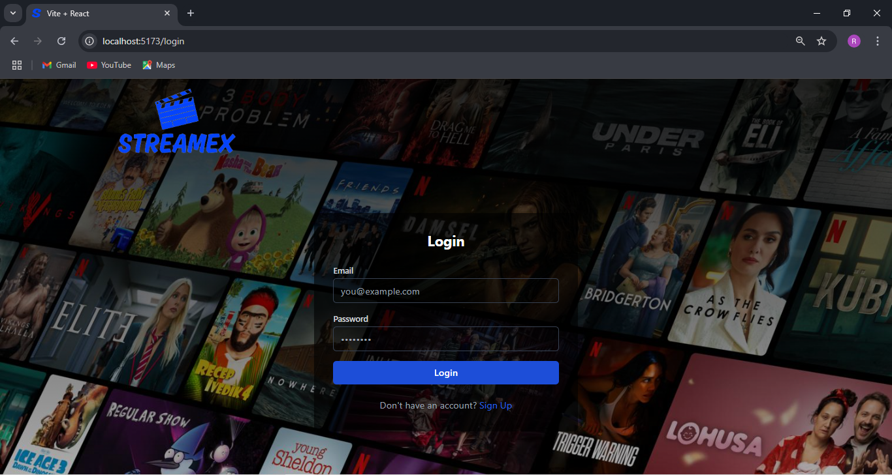
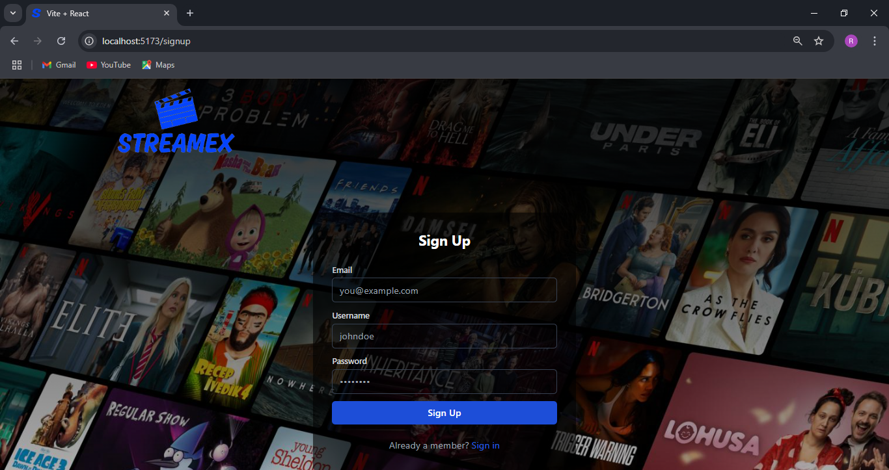
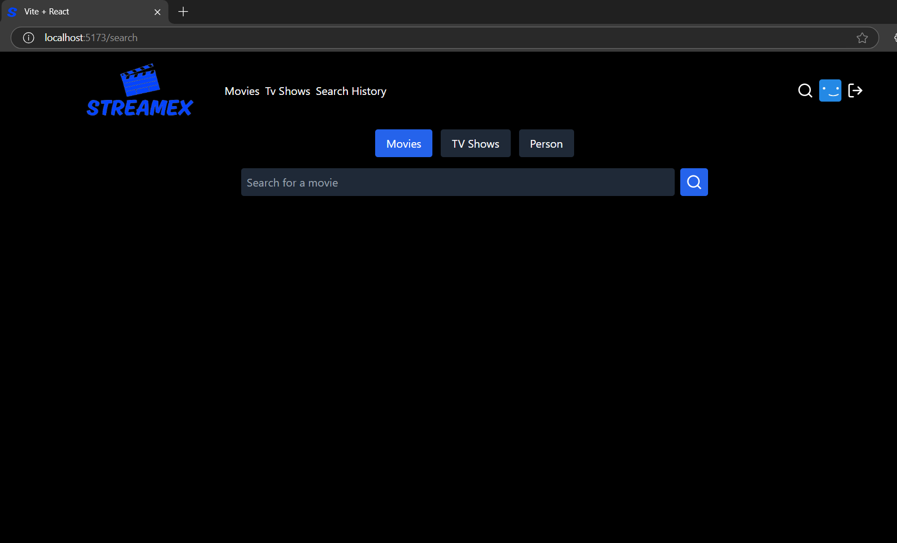
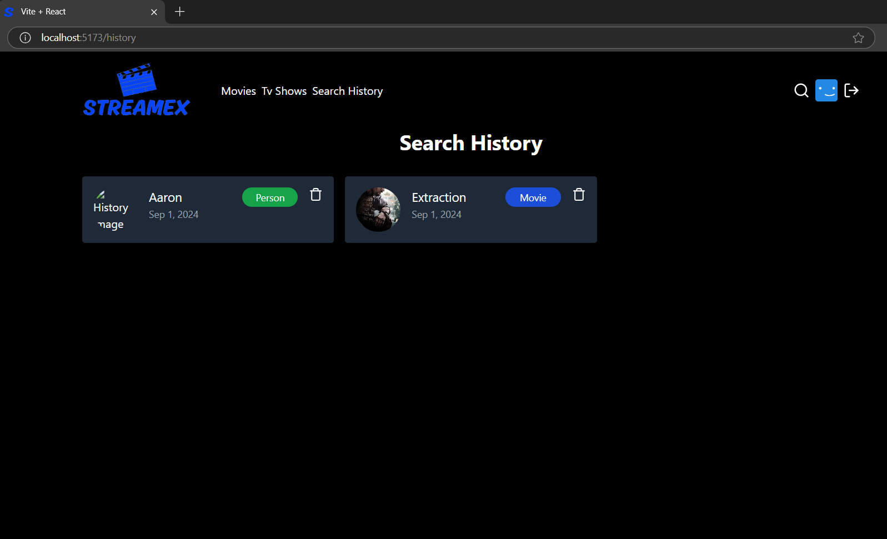
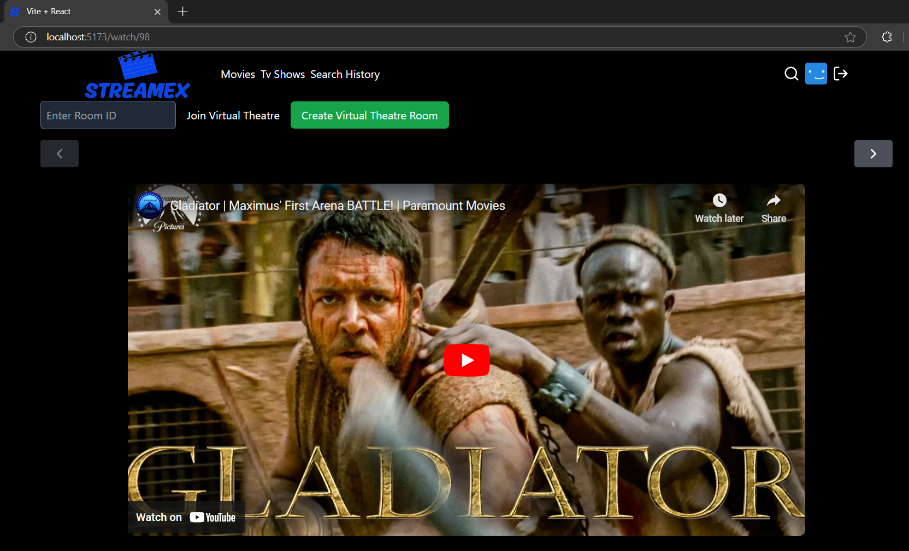
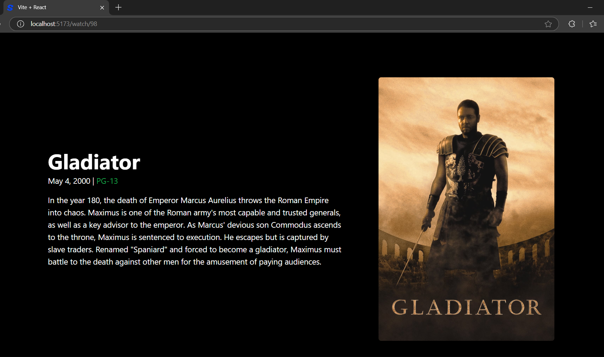

# StreamEx - A Netflix Clone  

StreamEx is a Netflix clone built using MERN stack. This project was created by following a YouTube tutorial with some modifications.  

## 🎥 Credits  

This project is based on a YouTube tutorial.  
- 🎬 **YouTube Video:** [MERN Netflix Clone Tutorial](https://www.youtube.com/watch?v=gRroBZczKAU&t=631s)  
- 💻 **Original GitHub Repository:** [burakorkmez/mern-netflix-clone](https://github.com/burakorkmez/mern-netflix-clone)  

I followed the tutorial and made some modifications to enhance the project.  

## 🚀 Features  
- Browse movie and TV show collections  
- Fetch data from TMDB API  
- Responsive design  
- Play trailers  

## About This Course:

⚛️ Tech Stack: React.js, Node.js, Express.js, MongoDB, Tailwind
🔐 Authentication with JWT
📱 Responsive UI
🎬 Fetch Movies and Tv Show
🔎 Search for Actors and Movies
🎥 Watch Trailers 
🔥  Fetch Search History
🐱‍👤 Get  Similar Movies/Tv Shows
💙 Awesome Landing Page
🌐 Deployment
🚀 And Many More Cool Features

## 📸 Screenshots  

### Homepage  
  

### Homescreen  
  

### Login Page 
  

### Signup Page  
  

### Search Page  
  

### Search history Page 

### Watch Page  
  
  

